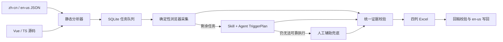

# 架构设计

## 设计原则

Collect I18n 的完成信号是“真实运行时证据”，不是静态文本命中，也不是 Agent 声称已完成。系统把问题拆成三个成本逐级上升的执行层，并让它们共享同一份任务、运行时绑定和证据模型：



系统不尝试让 Agent 自由控制一切。确定性能力负责可证明、可重复的部分；Agent 只补足“如何抵达状态”的推理；人工只处理认证、复杂业务数据或不可预测环境等最后边界。

## 模块边界

| 模块 | 责任 | 不负责 |
| --- | --- | --- |
| `core` | 稳定 ID、配置与跨进程协议 | 浏览器或文件写入 |
| `analyzer` | 发现语言包、扁平化 key、扫描 `$t`/`t`、关联路由和动作提示 | 判断页面是否真的显示 |
| `vite-vue` | 开发态转换 Vue SFC，注入稳定 occurrence 描述和运行时入口 | 修改磁盘上的目标源码 |
| `runtime` | 登记 DOM、Range、组件属性、命令式服务/Teleport 目标并监听 key | 导航或业务操作 |
| `runner` | 在同源页面执行受限 TriggerPlan、Mock 请求、等待目标并截图 | 任意 JavaScript、Shell 或跨域导航 |
| `cli` | 配置、SQLite、服务生命周期、任务状态机与工作台 API | 生成 Agent 推理 |
| `excel` | 严格四列工作簿、截图嵌入、回稿验证和受限写回 | 保存任务状态到 Excel |
| `studio` | 面向人工的进度、证据、Mock、监听与 Excel 界面 | 替代 CLI 事实协议 |
| `skill` | 指挥 Agent 按 CLI 协议完成剩余任务 | 绕过 CLI 直接篡改页面或任务 |

## 一次会话的生命周期

1. `doctor` 只读检查 Node、目标项目结构与关键依赖。
2. `init` 生成 `.collect-i18n/config.json`，扫描语言包/源码并将索引同步到 SQLite。
3. `start` 创建会话，加载目标项目自身的 Vite 配置，同时追加 Collect I18n 插件；目标源码和配置文件不落盘修改。
4. 服务按高置信路由批量处理 `pending` 任务。能在真实页面定位 key 的任务进入 `captured`，其余进入 `needs_agent`。
5. Skill 从 `agent next` 取得一个任务，生成版本化 TriggerPlan，经 `agent submit` 校验后由 `agent execute` 顺序执行。
6. Agent 重试仍失败的任务进入 `needs_manual`。`manual open` 打开目标路由并持续监听；人工触发真实状态后自动采集。
7. `export` 从会话目录与证据表生成工作簿；`import` 先对照同一会话目录做 dry-run，再按授权写入 `en-us`。

任务执行被串行化，避免确定性队列、Agent 和人工监听同时争用同一个浏览器页面。状态与失败原因写入 SQLite，因此 CLI、工作台与 Skill 看到的是同一事实。

## Key 与 occurrence

语言文件路径形成命名空间。例如：

```text
zh-cn/users/form.json + { "nameRequired": "请输入姓名" }
→ users.form.nameRequired
```

一个 Key Path 可以在源码出现多次，每次出现都有由文件位置和表达式计算出的稳定 occurrence ID。静态扫描保存以下信息：

- 源文件、行列与原始表达式；
- `native_dom`、`text_range`、`component_prop` 或 `imperative_service` 类型；
- 从路由配置、导航调用和组件文件得到的路由提示及置信度；
- 从模板事件、表单校验和脚本调用得到的动作提示。

确定性阶段只消费可靠路由和可直接定位的 DOM/文本 occurrence，避免把文件名猜测当成证据。低置信或需要操作的词条留给 Agent。

## 运行时绑定

仅给 DOM 元素加 `data-i18n-key` 无法覆盖组件属性和命令式提示，因此系统使用运行时登记表：

```text
编译期 occurrence 描述
        ↓
渲染值回报 / DOM 标记 / 文本 Range / 组件属性关联
        ↓
CollectorRegistry 快照
        ↓
按 target key 监听
        ↓
可见矩形 + 路由 + occurrence + 截图
```

Element Plus 的 Message、Notification 等服务通常 Teleport 到 `body`，生命周期也很短。服务调用与 DOM 观察共同把这些节点关联到调用处的 key；监听器先锁定目标，再由业务操作触发，因此不要求提示长期显示。

插桩仅用于采集开发服务器。正常生产构建不需要、也不应携带采集标记。

## TriggerPlan 安全边界

TriggerPlan 是版本化 JSON DSL，当前只允许：

- 同一项目源站内的 `goto` / `reload`；
- 由 role、label、text、test-id 或有源码依据的 CSS 定位器执行 click、fill、press、select、hover；
- 有上限的 wait、waitForText、waitForKey；
- 数量、延迟、响应体和匹配范围均受校验的请求 Mock。

计划步数和总执行时间都有硬上限。DSL 不支持 JavaScript 求值、Shell、任意文件访问、环境变量读取或跨域导航。

## 证据模型

截图只有同时满足下列条件才会令任务进入 `captured`：

- 目标 `Key Path` 与任务一致；
- key 已在当前真实页面绑定到可定位目标；
- 记录当前路由和采集时间；
- 截图成功写入会话 evidence 目录；
- 能取得时保存可见矩形、occurrence 和动作轨迹。

静态扫描、Agent 返回文本或仅出现中文字符串都不能替代上述证据。Excel 中没有截图的行表示当前会话没有可嵌入证据，不代表隐藏的“待翻译”状态。

## 数据与文件写入

目标项目内的 `.collect-i18n/state.sqlite` 保存项目、任务、证据与事件。浏览器资料、截图、计划、服务描述和导入导出临时文件也位于 `.collect-i18n/`，应被目标项目忽略。

Excel 导出始终以中文原文初始化英文列，不把当前 `en-us` 译文带入新任务。导入先检查工作表与四列表头，再核对 Key Path、中文原文和目录映射。写回路径必须解析到发现的 `en-us` 根目录内；JSON 写入保留 BOM、缩进、换行和尾换行风格，采用临时文件替换，并为已有文件创建 `.bak`。

## 扩展点

- 新框架适配器可以产生相同 occurrence 描述并接入 `runtime`。
- 新组件库适配器可以把命令式服务或 Teleport 节点登记到同一 Registry。
- 新 Agent 只需遵守 CLI JSON 协议和 TriggerPlan v1，不应直接依赖 SQLite 表结构。
- 新导出格式应以 Key Path 和证据目录为输入，不能把工作流状态塞进翻译工作簿。
